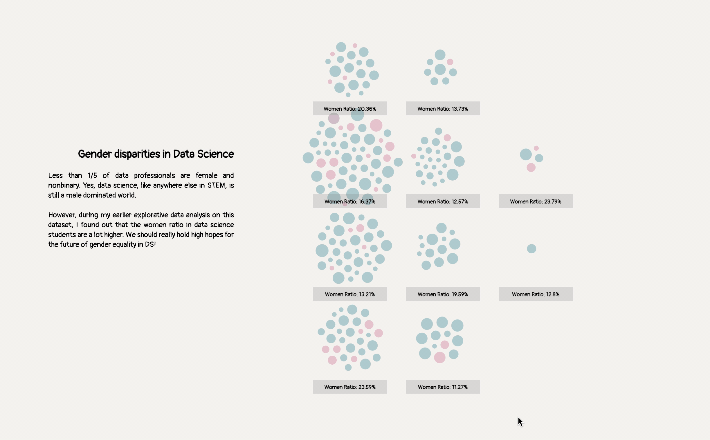

## things i wish i knew before studying data science
- a visual introduction to data science
- see the live website 🔗 [here](https://zoexiao0516.github.io/cdv-student/projects/data-story/index.html)

### 🥸 Intro
So you've decided to study data science and break into the DS field, let's listen to the voices of data professionals/Kagglers! This data visualization of [2020 Kaggle Data Science & Machine Learning Survey](https://www.kaggle.com/neomatrix369/kaggle-machine-learning-data-science-survey-ext) will take you on a journey through all of the different job titles in the DS fields, and compare salary, how many women are in this field, day-to-day roles, and other factors. 

### 💁 Demo

### 🧐 Contextual Report
🔗 [Report](https://docs.google.com/document/d/1h96KXEldADek-lqPRFLso4kd5AKw0UYde_EfX4Lo7Jk/edit?usp=sharing) and [Presentation Slides](https://drive.google.com/file/d/1V-25X_P6xaauIrY9LGy_1i6wDOU_6Rdl/view?usp=sharing)

### 📐 Paper Prototype
Click [here](paper-prototype) to check out.

### 🤹 Inspiritions

[A short demo of a scrolling data story using the Kaggle Titanic Data source](http://www.bmdata.co.uk/titanic/)

[A visual introduction to machine learning](http://www.r2d3.us/visual-intro-to-machine-learning-part-1/)

### 🗃 Archive Sources

[The historical cost of light](https://pudding.cool/2020/12/lighting-cost/)

This article is an amazing visualziation of how expensive artificial light was. By scrolling down this webpage, we are "working" to earn the light. There is a clear contrast between nowadays and hundreds of years ago. When we are scrolling, we are also entertained by some brief historical facts. Keeping scrolling down the page does feel like a labor to me. 

[What Airport Traffic Tells Us About the World's Megacities](https://pudding.cool/2018/07/airports/)

This artcile reveals a startling inequality in global economy. By comparing the fights in and out the world's megacities, we can spot several unusual data points derived from African cities. The number of fights is not correlated with the population growth in cities, which tells us that these cities are growing due to unsustainable rural living conditions, climate change, and war. People are moving out of necessity rather than opportunity.
