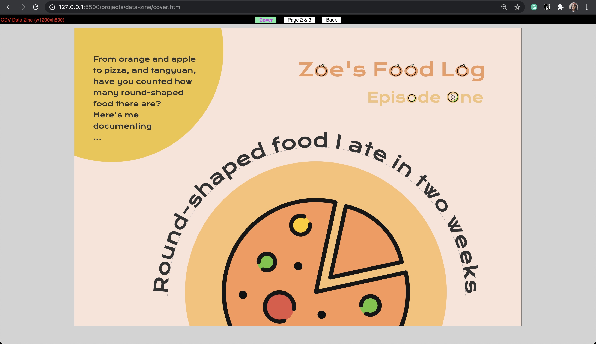
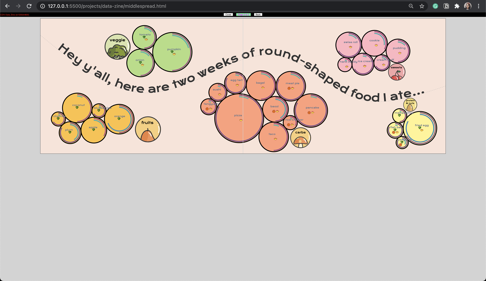
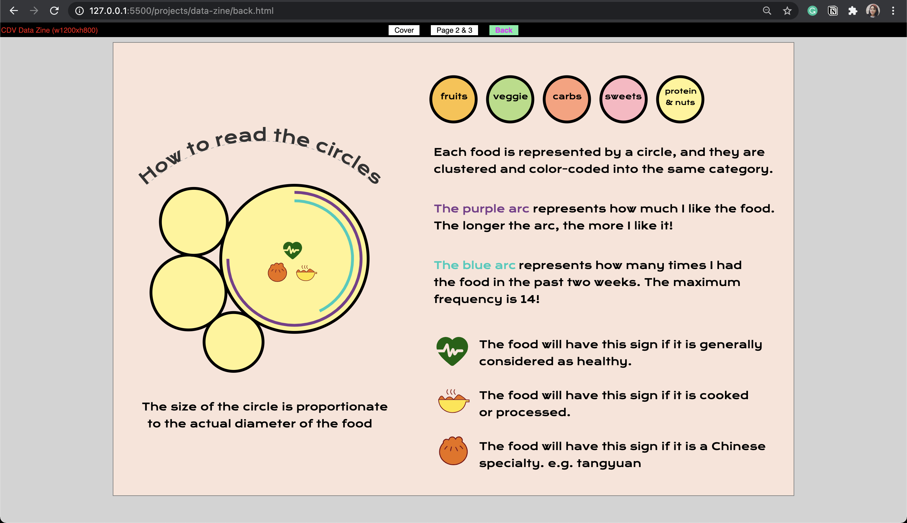

# 🍊 Data Zine Project ~ My Food Log

## *Episode One "The one with all the round-shaped food"*

### 🔗 Link to live website [here](https://zoexiao0516.github.io/cdv-student/projects/data-zine/cover.html)

### ⏯ The video presentation is available [here](https://youtu.be/aTo9ZZR92sc)

### 🍎 Screenshots

---

### Inspirations and References
[Dear Data](https://docs.google.com/spreadsheets/d/1PTTTbewj2zsqgztBhNZKB2ipunpI7jiok2tmm_kfhXE/edit#gid=0) by Giorgia Lupi and Stefanie Posavec 
[Text on an arc](http://bl.ocks.org/nbremer/bf3d285e48189507e0ea) 
[Text on arcs](https://www.visualcinnamon.com/2015/09/placing-text-on-arcs/) 
[Adding a curve with d3.line()](https://www.d3-graph-gallery.com/graph/shape.html#mysegment) 
[Force Simulation complex groups](https://bl.ocks.org/denisemauldin/e0a0c232f7a7f665fca87f395501049a) 
[color legend with an SVG gradient](https://www.visualcinnamon.com/2016/05/smooth-color-legend-d3-svg-gradient/)

### Difficulty
1. Draw clearer boundaries for what kind of data goes into my data collection
1. Cluster datapoints into the same category, and avoid collision
1. Draw an identifier for each cluster to show its category
1. Maintain a consistent design throughout four pages
1. Placing the additional features onto the circles after force simulation  

### Proposal
- **What data did you choose to collect?**  
  I decided to create a food log to document all the round-shaped food I ate the week before and after the Spring Festival. The features of the food I collect include their size, category, how much I like this food (fondness), and I counted how many times I ate them in the past two weeks (frequencies). I also add a bunch of boolean attributes: if it is a Chinese specialty, if it is healthy, and if it is cooked and processed.  

  This idea came to me because I had a lot of oranges, which are perfectly round, when I was at home a few weeks ago, and I wanted to keep track of how many more of those I eat.
  
- **How did you collect it, what was the routine?**  
  I would write it down on my phone every time I ate something in a round shape, and I would also take a picture of it for future references. Later I would organize the data points in Google Form and convert the data into json file.

- **Why did you choose to visualize the data in this way?**  
  First of all, I think the emphasis of this visualization is the clustering in accordance with their category. In order to do that, I wanted to place each data point based on their category, so I started to experiment with D3's force simulation methods with groups.   
  Also, for each data point, I think it is instinctive to have food, especially round-shaped food represented by circles. I was thinking of pizza when I decided on this. Because it will be very straightforward to see their size in contrast with each other. All the food in the same category would stick together as one cluster and share the same color.  

  The introduction of boolean attributes and using a special sign to represent them is one of the many inspirations drawn from *Dear Data*. So in my project, I use three special icons to indicate whether this particular food has this feature or not.  

  Lastly, for representing how much I like it and how many times I have it, I use arcs. I think the arc length is perfect for representing values on a specific scale. And an arc could add layers to the circle. And there is also a slight difference in the arc colors as the value differs, but I do not put an emphasis on it since there are already many colors on this page. This should come as a surprise for people who like to look very closely.

- **What can be seen in the visualization? Does it reveal something you didn't expect?**  
  If we zoom out, we can see there are five big clusters in total, with an identifier along with the food circles indicating the category. And if we take a closer look, there is the name tag of the food as well as other visual descriptions. 
  I was surprised to find out the "carbs" category has the dominating number of round-shaped food.

- **Did you make crucial compromises? Which ones?**  
  The biggest compromise I made was at the data-collecting process where I found myself have difficulty drawing the boundaries for my dataset. So I was originally recording round objects, not just food, that I "use" everyday, but after discussion with Leon, I realize there is a limitless amount of items in this list and that would be a bad start for visualization.  

  I initially left out the name for each food, and want to make it into a guessing game. But I found this game way too hard with the given information that I couldn't even guess myself.  
  
  Besides, the green heart-shaped icon indicating whether it is a healthy food is kind of a useless feature since people can tell if it is healthy with the name tag and category. But I do want to keep them as a reference.

- **If this project had a larger scaler and wasn't designed for print, how would you imagine it to be?**  
  If this project had a larger scale, I would probably make more clusters out of it. And I would make the name tag of each food "hide-and-show".

#### Timeline
- Week 3: Collect Data, First coding draft
- Spring Festival: Collect Data (this will contrast great with data collect during school time), Coding
- Week 4: Collect Data (Only if needed), Resolve coding questions
- Week 5: Final Coding
- Week 6: Presentation
*Due Monday, Mar 8*
