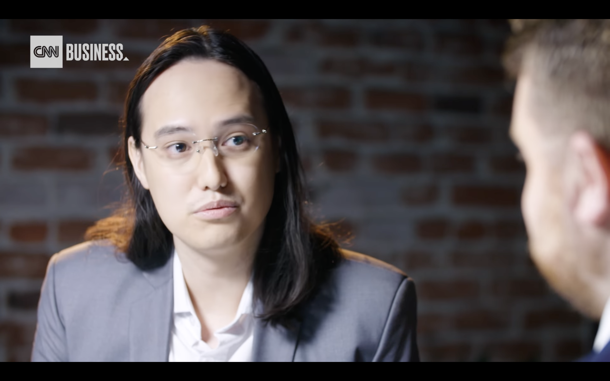

# Reading 5 (Ethics)

#### Material
##### Read
- [The Messy Truth About Social Credit](https://docs.google.com/document/d/1yi5y8stuTh4f3sycR12NcNZr4_u-jAU0Zq5HV-3gqOA/edit?usp=sharing), Shazeda Ahmed, 2019

##### Listen
- [Right to be Forgotten](https://www.wnycstudios.org/podcasts/radiolab/articles/radiolab-right-be-forgotten) (Podcast), Radio Lab (2019)
- [The Daily The End of Privacy as we know it?](https://www.nytimes.com/2020/02/10/podcasts/the-daily/facial-recognition-surveillance.html) (Podcast), The Daily (NYT) (2020)
- [The Supreme Court Of Facebook](https://open.spotify.com/episode/0eamK9A4qhp2nXwxKVG3PX?si=MGZ1B1nmTZOt6Z7PjSE6NQ) (Podcast), The New Yorker Radio Hour (2021) (this is a spotify link, but the podcase might be available at other sources. please contact me if you run into trouble accessing this one)

#### Assignment

1. Follow the instructions explained in the reading; it involved writing comments in a shared document.
2. Take notes while you are listening to the podcasts.
3. Collect your thoughts on *Ethics* and data. Formulate a short response (250-400 words) to the following prompts.
  - Right to be forgotten:
    - try to come up with a set of guidelines how public records/data should be dealt with -- and/or discuss the difficulties of this task.
    - can you think of other situations for similar kinds of dilemmas?
  - The End of Privacy As We Know it?
    - weigh the benefits and risks of a system like ClearView
    - which aspects do you find particularly problematic & how might we regulate undertakings like this?
  - Add your associations, opinions and ideas.

#### Response
“Bad news travels at the speed of light.” This sentence is no longer a rhetoric speech if we press that “publish” button. In the “right to be forgotten” project, there were a bunch of journalists who would take down some stories/reports that no longer have major consequences and give some people second chances. But in my opinion, a criminal record should never be carelessly publicized with real names and photos, and I don’t think it is possible to be erased on the internet completely. First of all, putting aside the issue of human rights for suspects, the disclosure of the case may cause secondary harm to the victims and their families. And even if the victim offers to disclose details, any publication of criminal details should be dealt with case by case. I feel like the public always likes to focus on the victims. Though in this project, the journalists talked about how a person's previous wrongdoing was ruining their lives after it was made public. But maybe in some cases, it's more lives not explicitly covered in the reports that are affected, like the kids and parents who are left out in the story, but who are hurt the most.

The public record/data does not have an expiration date, nor does it have a limited publishing. I googled myself more than once. As I was growing up, the amount of data about me on the internet is also growing. The last time I googled myself, I found a picture of me in middle school, an essay I wrote back in elementary school. Though I was purely surprised to find these data about me, I couldn’t say I’m not worried that someday something strange would appear and I couldn't do anything about it. And speaking of personal data, the second story about face recognition and the overuse (or maybe misuse?) of social media information is really frightening. 

I got more goosebumps while listening to the story about Clearview AI than all the drama I watched this year combined. This guy really creeped me out with his algorithms and his making light of everyone’s privacy. So far, the things that Clearview AI does are somehow legal and controlled, Hoan Ton-That says he’s only selling the app to law enforcements and the banking sector. But I’m really worried about the future of this app. What if they decided they want to expand the usage. I also found that we can request Clearview AI to give the results of the images we send to them (via email), and this does not sound safe to me at all. Though the app helps fight crime, why doesn't the US government question its legitimacy? Maybe any app that involves so much extensive use of personal data and databases should have an oversight board like Facebook.
